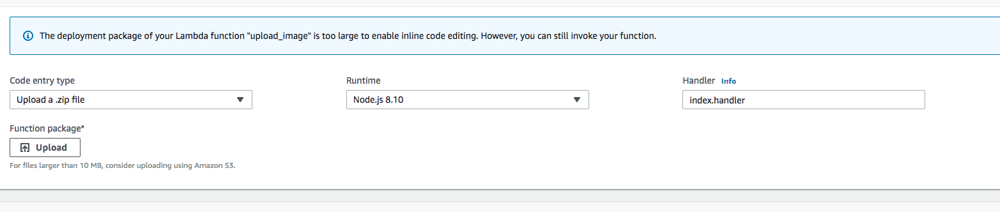
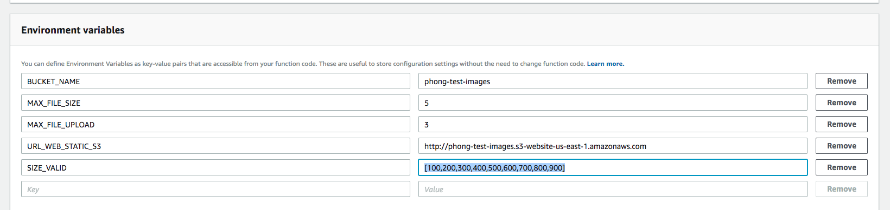
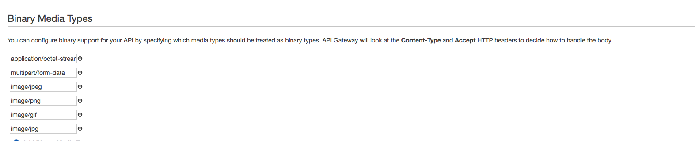

#AWS LAMBDA + AWS S3 + AWS API GATEWAY + AWSIAM 

 
## TO RUN PROJECT AT LOCAL
- STEP1: npm install
- STEP2: npm start
- STEP3: create bucket in S3 with the same name of env was set at `constant.js`
- STEP4: make bucket is and ACL is pulic

- NOTE: (with `sharp` module will have node_module install different so recommend use right OS when npm install to run)
when deploy run this comment (`env npm_config_arch=x64 npm_config_platform=linux npm_config_target=8.10.0 npm install --save sharp`)
## SETUP UPLOAD IMAGES
### I./ Lambda 
-  Coding your source (2 way to setup lambda funciton)
  - Way1: you can create funciton lambda on editor of lambda
  - Way2: if your project use express use can use   [aws-serverless-express](https://www.npmjs.com/package/aws-serverless-express) or [claudia](https://www.npmjs.com/package/claudia) to change your `server` to `server-less`

  *** NOTE: 
- SIZE `.zip = 50mb` and `unzip=250mb`
- if your project you is big so you can .zip your function and upload (Note you must .zip all file at root  `NOT YOUR FOLDER CONTAIN PROJECT` and `YOUR NODE_MODULES`)
- You can set your enviroment of your lambda function  at 
  lambda => Environment variables 
   
- Add ${file.name}.${function} (In project I export handler in index.js so i will add `index.handler` just like in image)
  
### II./ API GATE WAY
- create your api gate way
  - if you use way 1 (Above at lambda) to create lambda function you must create methods to trigger your lambda function (1 method for 1 lambda)
  - if you use way 2 (express => serverless) you should create apigate way as proxy. Now your request come to api gateway with proxy to serverless lambda serverless
  - REMEMBER  deploy your API after modify anything on API gateway
- *** NOTE
  - APIGATE now is support upload for binary(after 6/2017), but if you want to use upload binary use must set up at 
  - `API GATEWAY` => `select your apigate way (api you connect with lambda)` => `setting` => `Binary Media Types` => add `multipart/form-data`,`image/jpeg`,...
 

